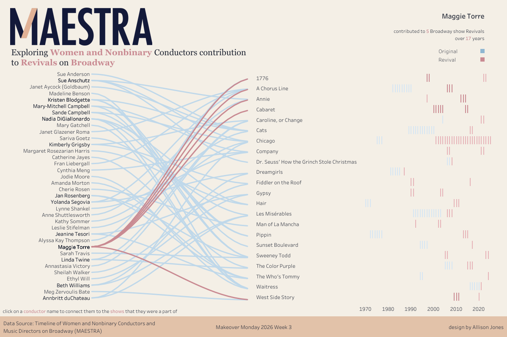
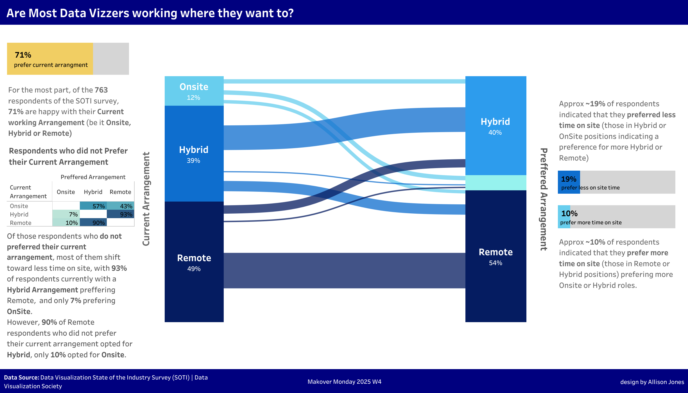

# Welcome to my Makeover Monday Repository
First of all - thanks for stopping by.
* **Tableau Public** : - if you haven't - please check out my [Tableau Public Profile](https://public.tableau.com/app/profile/allison.jones) as this is really a complementary space for the showcase pieces there
* **LinkedIn** : Also - if you to connect with me on [LinkedIn](https://www.linkedin.com/in/allisonjones-data/) - I always welcome feedback and connecting with others

# Makeover Monday — Data Preparation & Visualization

This repository contains my Makeover Monday projects, where I explore public datasets through data modeling, analysis, and Tableau visualization.
Each project emphasizes clarity of data structure, intentional chart design, and thoughtful storytelling over novelty alone.
While the final outputs are Tableau dashboards, a lot of the work happens with data exploration and preparation - cleaning data, reshaping it for visualization, and experimenting with visual encodings that best fit the story in the data.

# My Makeover Monday Mindset

I am trying to challenge myself. This is more than just portfolio building for me - I am trying to stretch myself with regards to:
 * stretching my **python skills**
 * honing my **data analytics** skills
 * refining my **Tableau Storytelling**
 * and even dipping my toes back into **data science** as this is a way for me to reconnect with experimentation, especially where it fits naturally.

Across these projects, I plan to focus on on:
* Designing **data models** that serve the visualization, not the other way around
* Using **scaffolding / densification** techniques when the visual form requires it
* Exploring relationship-driven charts (flows, paths, timelines) when the data implies movement or connection
* Keeping notebooks readable and reproducible for others learning Tableau + Python + SQL (but please forgive my spelling mistakes because Google hasn't added spell checked to their UI yet)
Several projects are inspired by advanced Tableau techniques by amazing creators such as the **Flerlage Twins**, **Toan Hoang**, as well as the broader Tableau community, and I will always try to credit inspiration where I find it.

# Notebooks
I will try to keep my notebooks as consistent as possible - but these are often just working documents and I am not always using a template.
Each notebook typically includes:
1. **Problem framing**
 * What question the dataset can (and cannot) answer
 * Initial design ideas for the visualization
2. **Data preparation**
 * Cleaning and standardization
 * Feature engineering
 * Data reshaping for Tableau (long vs wide, scaffolding, ranking, etc.)
3. **Visualization-driven modeling**
 * Creating intermediate datasets to support specific chart mechanics
 * Examples:
   * Year-by-year scaffolding for timelines
   * Interpolation tables for curved paths
   * Rank normalization to evenly space visual elements
4. **Tableau Output**
 * Link to my Tableau Dashboard and some Comments about it
 * Each project notebook links directly to its corresponding Tableau dashboard.

<h2>Makeover Monday Featured Vizzes</h2>

<table>
  <tr>
    <td align="center">
      <a href="https://public.tableau.com/views/MoM2026_w3WomenConductorsonBroadway/ExploringWomenConductorscontributiontoRevivalsonBroadway">
        
         <b>Women+ Conductors on Broadway</b>
      </a>
    </td>
    <td align="center">
      <a href="https://public.tableau.com/views/MoM2026_w1RollerCoasters/WhereintheWorldaretheTallestRollerCoasters">
        
         <b>Tallest Rollercoasters</b>
      </a>
    </td>
  </tr>

  <tr>
    <td align="center">
      <a href="https://public.tableau.com/views/MoM2026_w2RealEstateBubbleRisks/RealEstateBubbleRisks">
        
         <b>Housing Bubble Risk</b>
      </a>
    </td>
    <td align="center">
      <a href="https://public.tableau.com/views/MoM2025_w4CurrentandPrefferedWorkArrangement/AreMostDataVizzersworkingwheretheywantto">
        
         <b>Data Vizzer Work Arrangement</b>
      </a>
    </td>
  </tr>
</table>
